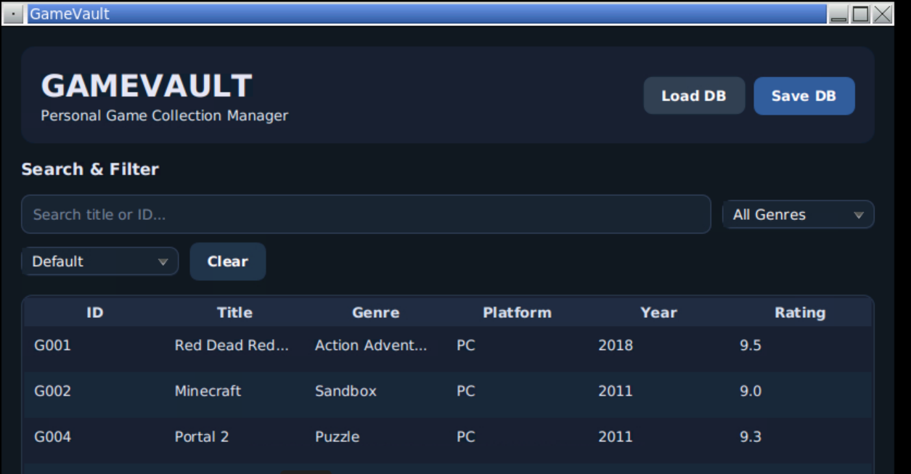
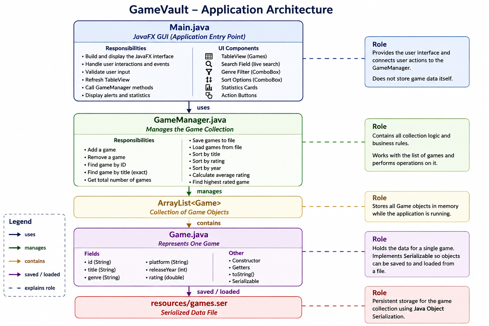
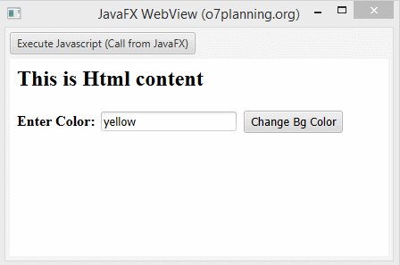

# Advanced Object Oriented Computing Project

**Title:** GameVault - Game Collection Manager  

**Name:** Aoife Adair  

**Student ID:** G00463278  

**Screencast Link:** https://youtu.be/gRfU6x0krMY

> 💻 **Open this project in GitHub Codespaces:** click the green **Code** button, choose **Codespaces**, then create or open a codespace on `main`.

## Application Function

GameVault is a JavaFX application for managing a personal video game collection.

Each game contains:

- Unique ID
- Title
- Genre
- Platform
- Release year
- Rating

The application supports the seven required operations:

1. **Load DB**
2. **Add Game**
3. **Delete Game**
4. **Find Game**
5. **Show Statistics / Total**
6. **Save DB**
7. **Quit**

Extra features include:

- Live search by ID or title
- Genre filtering
- Sorting by title, rating and year
- Collection statistics
- Input validation
- Delete confirmation
- Custom JavaFX styling

### Application Screenshot



## Running the Application

GameVault was developed in GitHub Codespaces using Java 21 and JavaFX.

1. Open the repository in **GitHub Codespaces**.
2. Open a terminal.
3. Compile the project:

```bash
mkdir -p out
javac -d out $(find src -name "*.java")
```

4. Copy the stylesheet:

```bash
cp resources/styles.css out/styles.css
```

5. Run the application:

```bash
java -cp out ie.atu.mypackage.Main
```

6. Open the forwarded noVNC desktop.
7. Click **Load DB** to load the saved collection.

No additional Java installation is required when using the supplied Codespaces environment.

## Project Requirements

GameVault meets the minimum project and feature requirements in the [**project brief**](project-brief.md).

The project includes:

- `Main.java`
- `Game.java`
- `GameManager.java`
- `ArrayList<Game>`
- Stream API
- Lambda expressions
- File I/O
- Exception handling
- Object serialisation and deserialisation
- JavaFX GUI
- All seven required operations

The `Game` class implements `Serializable`, and the collection is saved to:

```text
resources/games.ser
```

The `GameManager` class handles adding, removing, searching, saving, loading and counting games.

The project was developed in GitHub Codespaces and version controlled using Git and GitHub, with regular commits made throughout development.

## Project Requirements Above and Beyond

GameVault includes several features beyond the minimum requirements.

### TableView

A JavaFX `TableView` displays each game's ID, title, genre, platform, year and rating.

### Search and Filtering

The user can search by title or ID and filter games by genre.

### Sorting

Games can be sorted by:

- Title A-Z
- Highest Rating
- Newest First

### Statistics

The application displays:

- Total games
- Average rating
- Highest-rated game

### Validation

The application checks for:

- Duplicate IDs
- Empty fields
- Invalid years
- Invalid ratings
- Ratings outside 0-10

### Custom Interface

A custom `styles.css` file provides a dark theme, styled controls, table rows and statistics cards.

## Application Architecture

> **Scope:** the *code* — classes, methods and data structures used by the application.

### `Game.java`

Represents one game and stores:

- ID
- Title
- Genre
- Platform
- Release year
- Rating

It implements `Serializable`, allowing `Game` objects to be serialised and deserialised.

### `GameManager.java`

Stores the collection using:

```java
ArrayList<Game>
```

It contains methods for:

- Add
- Remove
- Search
- Total
- Save
- Load
- Sort
- Average rating
- Highest-rated game

The manager also handles serialisation, deserialisation and file-related exception handling.

### `Main.java`

Creates the JavaFX interface and handles:

- Buttons
- TableView
- Search
- Filtering
- Sorting
- Statistics
- Validation
- Alerts
- User input

The class relationship is:

```text
Main
  |
  v
GameManager
  |
  v
ArrayList<Game>
  |
  v
Game
  |
  v
resources/games.ser
```



## JavaFX

> **Scope:** the *UI design* — layout, styling and navigation.

GameVault uses a dark JavaFX interface with:

- Header
- Search field
- Genre filter
- Sort menu
- Game table
- Statistics cards
- Action buttons

The interface uses `VBox` and `HBox` layouts to organise controls clearly.

The custom stylesheet is stored in:

```text
resources/styles.css
```

The dark design was chosen to suit the theme of a video game collection application.



## Roadblocks and Unfinished Functionality

One challenge was running JavaFX inside GitHub Codespaces. The application is displayed through the supplied noVNC desktop.

Another issue was the first interface being too wide for the noVNC window. This was fixed by reducing the default size, resizing the table columns and reorganising the search controls.

Serialisation also required careful handling so the `ArrayList<Game>` could be safely saved and loaded using serialisation and deserialisation.

The application currently contains the required functionality and planned enhanced features.

If I were developing the application again, I would plan the final JavaFX layout earlier so that less resizing and interface adjustment would be required near the end of development.

Possible future improvements include:

- Editing games
- Cover images
- Completion status
- Play-time tracking
- More statistics
- Automatic saving
- Standalone Windows packaging

## Resources

* [Java Documentation](https://docs.oracle.com/en/java/)
* [JavaFX Documentation](https://openjfx.io/)
* [GitHub Documentation](https://docs.github.com/)
* Course laboratory material
* `project-brief.md`
* Supplied AOOC project template

### AI Assistance

AI was used to assist with:

- Java and JavaFX explanations
- Debugging
- Git commands
- Interface improvements
- Code review
- Documentation

The final application was tested during development, and I can explain the code and functionality demonstrated in the project screencast.